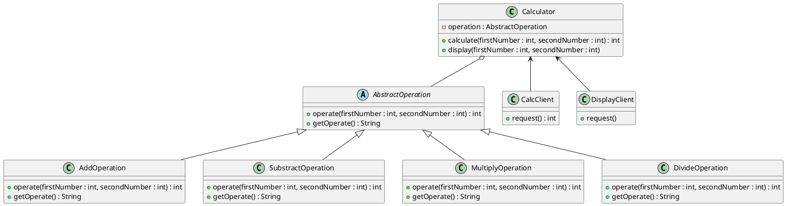

```plantuml
@startuml
Calculator o-- AbstractOperation
Calculator <-- CalcClient
Calculator <-- DisplayClient
AbstractOperation <|-- AddOperation
AbstractOperation <|-- SubstractOperation
AbstractOperation <|-- MultiplyOperation
AbstractOperation <|-- DivideOperation

class Calculator {
    - operation : AbstractOperation
    + calculate(firstNumber : int, secondNumber : int) : int
    + display(firstNumber : int, secondNumber : int)
}

abstract class AbstractOperation {
    + operate(firstNumber : int, secondNumber : int) : int
    + getOperate() : String
}

class AddOperation {
    + operate(firstNumber : int, secondNumber : int) : int
    + getOperate() : String
}

class SubstractOperation {
    + operate(firstNumber : int, secondNumber : int) : int
    + getOperate() : String
}

class MultiplyOperation {
    + operate(firstNumber : int, secondNumber : int) : int
    + getOperate() : String
}

class DivideOperation {
    + operate(firstNumber : int, secondNumber : int) : int
    + getOperate() : String
}

class CalcClient {
    + request() : int
}

class DisplayClient {
    + request()
}
@enduml
```