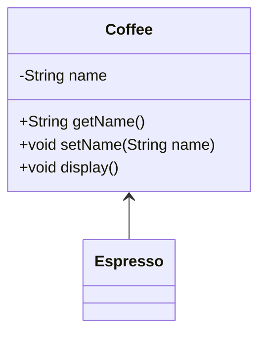

[목록](https://github.com/JungInBaek/TIL/blob/main/README.md)

# 1. 상속(generalization)

## 1-1. 설명
  - 일반화된 사물과 특수화된 사물과의 관계를 표현한다.

## 1-2. 클래스 다이어그램



## 1-3. 구현소스
Coffee.java
```java
public class Coffee {
  private String name = "Coffee";

  public Coffee() {}

  public String getName() {
    return name;
  }

  public void setName(String name) {
    this.name = name;
  }

  public void display() {
    System.out.println(this.name);
  }
}
```

Espresso.java
```java
//  Coffee를 상속
public class Esspresso extends Coffee {
  
  public Espresso() {
    super();
  }
}
```

Client.java
```java
public class Client {

  public static void main(String[] args) {
    Coffee coffee = new Coffee();

    System.out.println(coffee.getName());
    //  > Coffee

    coffee.display();
    //  > Coffee

    Coffee espresso = new Espresso();
    espresso.setName("Espresso");

    System.out.println(espresso.getName());
    //  > Espresso

    espresso.display();
    //  > Espresso
  }
}
```