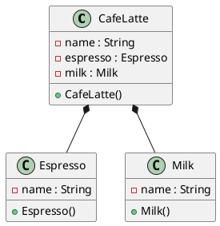

[목록](https://github.com/JungInBaek/TIL/blob/main/README.md)

# 5. 합성(composition)

## 5-1. 설명
- 전체와 부분간의 관계를 표현한다.
- 전체가 소멸될 때 부분도 함께 소멸되는 특징이 있다.

## 5-2. 클래스 다이어그램


## 5-3. 구현소스
Espresso.java
```java
public class Espresso {
  private String name = "Espresso";

  public Espresso() {
    super();
  }

  public String getName() {
    return name;
  }

  public void setName(String name) {
    this.name = name;
  }

  @Override
  public String toString() {
    return "Espresso";
  }
}

Milk.java
```java
public class Milk {
  private String name = "Milk";

  public Milk() {
    super();
  }

  public String getName() {
    return name;
  }

  public void setName(String name) {
    this.name = name;
  }

  @Override
  public String toString() {
    return "Milk";
  }
}
```

CafeLatte.java
```java
public class CafeLatte {
  private String name = "CafeLatte";

  //  CafeLatte의 멤버변수로 선언하고 객체를 생성
  private Espresso espresso = new Espresso();
  private Milk milk = new Milk();

  public CafeLatte() {
    super();
  }

  public String getName() {
    return name;
  }

  public void setName(String name) {
    this.name = name;
  }

  public void display() {
    System.out.println(this.name + " (" + this.espresso + " + " + this.milk + ")");
  }

  @Override
  public String toString() {
    return "CafeLatte";
  }
}
```

Client.java
```java
public class Client {
  
  public static void main(String[] args) {
    CafeLatte cafeLatte = new CafeLatte();

    cafeLatte.display();
    //  > CafeLatte (Espresso + Milk)
  }
}
```