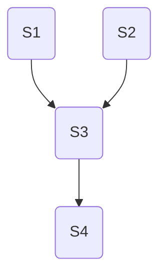
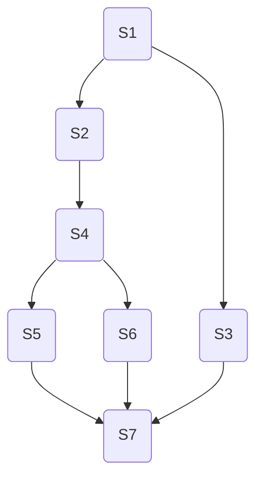
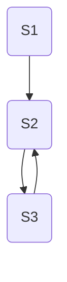
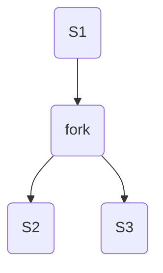
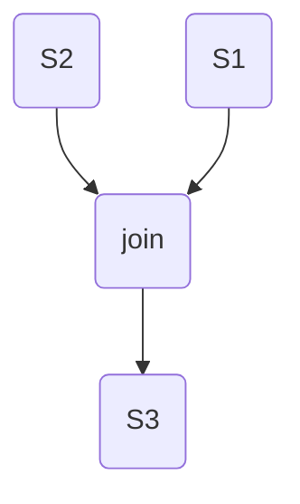
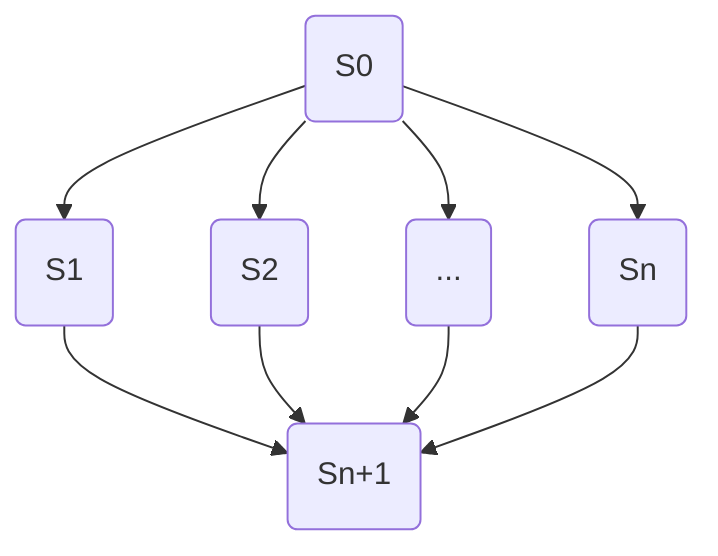

[목록](https://github.com/JungInBaek/TIL/blob/main/README.md)

# 1. 병행 프로세스의 개념
프로세서는 하나는 한 번에 프로세스 하나만 실행할 수 있다. 하지만 운영체제가 프로세서를 빠르게 전환하여 프로세서 시간을 나눠서 마치 프로세스 여러 개를 동시에 실행하는 것처럼 보이게 하는 것을 병행 프로세스라고 한다. 병행 프로세스는 단일 처리 시스템에서 서로 독립적으로 작업을 수행하는 독립 프로세스, 다른 프로세스와 협력하면서 특정 기능을 수행하는 비동기적 병행 프로세스인 협력 프로세스로 구분한다.

- 독립 프로세스
독립 프로세스는 단일 처리 시스템에서 수행하는 병행 프로세스로, 다른 프로세스에 영향을 주고받지 않으면서 독립적으로 실행한다. 그래서 다른 프로세스, 데이터와 상태를 공유하지 않고 동작도 재현할 수 있다. 또 주어진 초깃값에 따라 항상 동일한 결과를 보여 주고, 중지했다가 변동 사항 없이 다시 시작할 수 있다. 다음은 프로세서에서 독립적으로 실행할 수 있는 프로세스 예이다.
    - 단일 프로그래밍 : 프로세서를 사용 중이던 프로세스를 완료한 후 다른 프로세스를 실행한다.
    - 다중 프로그래밍 : 프로세스 여러 개가 프로세서 하나를 공유한다. 공유하지 않는 상태일 때 디스패치 순서는 상관없다.
    - 다중 처리 : 프로세서를  2개 이상 사용하여 동시에 프로그램 여러 개를 병렬로 실행한다.

- 협력 프로세스
협력 프로세스는 다른 프로세스와 상호작용하며 특정 기능을 수행하는 비동기적 프로세스이다. 제한된 컴퓨터 자원의 효율성을 증대하고, 계산 속도를 향상시키고, 모듈적 구성을 강화하고, 개별 사용자가 여러 작업을 동시에 수행할 수 있는 편의성을 제공하는데 사용한다.

병행 프로세스들이 자원을 서로 이용하려고 하면 충돌이 발생한다. 이런 자원들은 다른 프로세스의 영향을 받거나 상태가 변하면 안되므로 프로세스는 다음 세 가지 형태로 상호작용한다.

(1) 프로세스는 서로 인식하지 못하는 경쟁 관계를 유지한다. 운영체제가 자원 경쟁을 고려하여 동일한 디스크나 프린터로 접근을 조절한다.

(2) 프로세스는 입출력 버스를 비롯한 개체를 공유하는 단계에서 간접적으로 서로의 관계를 인식한다. 이때 다른 프로세스에서 얻은 정보에 의존할 수 있고, 프로세스 타이밍에 영향을 받을 수 있다. 그러므로 프로세스들은 개체 공유에 따른 협력이 필요하다.

(3) 프로세스에는 서로를 인식하고 프로세스끼리 통신할 수 있는 기본 함수가 있다. 프로세스가 서로 협력 관계에 있으면 직접 통신이 가능하고 병행해서 함께 동작할 수 있다.

경쟁 관계에 있는 프로세스들은 서로 정보를 교환하지 않지만, 한 프로세스의 수행이 나머지 프로세스의 수행에 영향을 미칠 수 있어 상호배제가 필요하다.

# 2. 병행 프로세스의 해결 과제
병행성은 여러 프로세스를 이용하여 작업을 수행하는 것이다. 병행성은 시스템의 신뢰도를 높이고 처리 속도를 개선하여 처리 능력을 높이는데 매우 중요한데, 다음 몇 가지 문제를 해결해야 한다.
- 공유 자원을 상호 배타적으로 사용해야 한다. 예를 들어, 프린터, 통신망 등은 한순간에 프로세스 하나만 사용해야 한다.
- 병행 프로세스 간에는 협력이나 동기화가 되어야 한다. 상호 배제도 동기화의 한 형태이다.
- 두 프로세스 사이에서는 데이터를 교환할 수 있도록 통신이 되어야 한다.
- 프로세스는 동시에 수행하는 다른 프로세스의 실행 속도와 관게없이 항상 일정한 실행 결과를 보장하도록 결정성(determinacy)을 확보해야 한다.
- 교착 상태를 해결하고 병행 프로세스들의 병렬 처리 능력을 극대화해야 한다.
- 실행 검증 문제를 해결해야 한다.
- 병행 프로세스를 수행하는 과정에서 발생하는 상호배제, 즉 어떤 프로세스가 작업을 실행 중일 때 나머지 프로세스는 그것과 관련된 작업을 수행할 수 없도록 보장해야 한다.

다중 처리 시스템에서는 프로세서들이 모든 입출력장치와 메모리를 참조할 수 있어 동시에 동일한 자원에 접근할 때 충돌이 발생할 수 있다. 따라서 프로세서 간의 충돌을 해결하는 방법이 필요하다.

# 3. 선행 그래프와 병행 프로그램
프로세스들이 선행 그래프를 이용하여 상호배제를 보장하는 방법을 살펴보기 전에 프로그래밍 언어에서 문장 간의 선행 관계를 그래프로 표현하는 선행 그래프의 개념과 종류를 먼저 살펴보자.

## 3-1. 선행 그래프
프로세스는 프로세스 집합과 이것의 선행 제약(precedence constraint) 두 가지 요소로 정의할 수 있다. 선행 제약은 프로세스를 순서대로 다른 상태로 옮기는 것이다. 두 프로세스에 선행 제약이 없으면 이 둘은 독립적이라서 병행 실행이 가능하다.

선행 그래프(precedence graph)는 선행 제약을 논리적으로 표현한 것이다. 노드i에서 노드j로 활동j를 시작하기 전에 활동i를 완료해야 한다는 순차적 활동을 표현하는 방향성 비순환 그래프이다.

다음은 간단한 산술 연산을 수행하는 알고리즘과 이것의 선행 그래프이다.

a := x + y;  ==> S1
b := z + 1;  ==> S2
c := a + b;  ==> S3
d := c + 1;  ==> S4
(a) 알고리즘

==========================================================================

(b) 선행 그래프

이처럼 단일 프로그램에서도 여러 문장에 선행 제약이 들어 있다.
- S1과 S2는 서로 독립적이므로 동시에 수행할 수 있다.
- S3은 a값과 b값을 할당받기 전에 수행하면 안 된다.
- S4는 C값을 계산하기 전에 수행할 수 없다.

(a)에서 알고리즘의 일부를 병행 수행하려면, 프로세서 하나에 기능 단위를 여러 개 두거나 프로세서를 여러 개 사용한다. 특히 프로세서를 여러 개 사용하면 여러 문장을 동시에 수행할 수 있어 총 수행 시간을 줄일 수 있다.

선행 그래프는 각 문장에 대응하는 노드를 비순환 그래프로 나타낸다. 노드 Si에서 노드 Sj로 가는 연결선(edge)은 문장 Si를 완전히 수행한 후 문자 Sj를 수행했음을 의미한다. 선행 그래프와 선행 관계는 다음과 같다.

(a) 선행 그래프

==========================================================================

- S2와 S3은 S1이 끝난 후에 수행한다.
- S4는 S2가 끝난 후에 수행한다.
- S5와 S6은 S4가 끝난 후에 수행한다.
- S7은 S5, S6, S3이 끝난 후에 수행하고, S3은 S2, S4, S5, S6과 병행하여 수행할 수 있다.

(b) 선행 관계

이처럼 선행 그래프는 비순환적이어야 한다. 아래 그림과 같은 순환 선행 그래프에서 S3은 S2가 끝난 후에 수행할 수 있고, S2는 S3이 끝난 후에만 수행할 수 있다는 선행 관계가 있다. 그런데 이 제약은 동시에 만족할 수 없는데, 수행 순서를 정의할 수 없어 모순이 발생한다.

순환 선행 그래프

## 3-2. fork와 join 구조
선행 그래프는 연산의 선행 제약을 정의하는데 유용하지만, 2차원이라 프로그램에는 사용하기가 어렵다. 그러므로 프로그램에 선행 관계를 명시하려면 fork와 join 구조, 병행 문장(parbegin/parend) 등 다른 방법이 필요하다.

프로그램에서 fork L 문장을 사용하면 병행 프로세스를 2개 만든다. 하나는 레이블이 L인 문장에서 수행을 시작하고, 다른 하나는 fork 명령어 바로 다음 문장에서 시작한다. 예를 들어, (a)의 알고리즘에서 fork L 문장을 수행하면 새로운 연산 프로세스를 S3에서 시작한다. 이는 S2에서 시작하는 연산 프로세스와 병행하여 수행한다. 이처럼 fork 명령어는 단일 연산을 독립 연산 2개로 분할한다.

&nbsp;&nbsp;&nbsp;&nbsp;S1;
&nbsp;&nbsp;&nbsp;&nbsp;fork L;
&nbsp;&nbsp;&nbsp;&nbsp;S2;
&nbsp;&nbsp;&nbsp;&nbsp;...
L : S3;

(a) 알고리즘

==========================================================================

(b) 선행 그래프

join 명령어는 병행 연산 2개를 하나로 결합하는 방법을 제공한다. 연산 2개를 수행 중이라고 할 때 이 둘의 속도가 다르므로 둘 중 하나는 join을 먼저 수행하고 join 후에 다른 연산을 수행한다. 연산 3개를 합쳐야 한다면 연산 2개가 끝난 후 join한 결과와 나머지 연산을 join한다. 따라서 마지막 연산 하나를 남기고 나머지 연산을 모두 끝내려면 연산 수를 알아야 하므로 이를 매개변수로 명시한다.

예를 들어, count 매개변수가 있는 join 명령어를 수행하는 방법은 다음과 같다. count는 0이 아닌 정수 값이고, quit는 count의 계산 수행을 종료하는 명령어이다. join할 연산이 2개라면 매개변수 count이 초깃값은 2가 될 것이다.

count := count - 1;
if count = 0 then quit;

join 명령어는 단위적으로 수행해야 한다. 즉, join 문장 2개를 병행 수행하는 것은 두 문장을 임의의 순서로 순차적으로 수행하는 것과 같다.

&nbsp;&nbsp;&nbsp;&nbsp;&nbsp;&nbsp;&nbsp;count := 2;
&nbsp;&nbsp;&nbsp;&nbsp;&nbsp;&nbsp;&nbsp;fork L1;
&nbsp;&nbsp;&nbsp;&nbsp;&nbsp;&nbsp;&nbsp;...
&nbsp;&nbsp;&nbsp;&nbsp;&nbsp;&nbsp;&nbsp;S1;
&nbsp;&nbsp;&nbsp;&nbsp;&nbsp;&nbsp;&nbsp;goto L2;
L1 : S2;
L2 : join count;
&nbsp;&nbsp;&nbsp;&nbsp;&nbsp;&nbsp;&nbsp;S3;

(a) 알고리즘

==========================================================================

(b) 선행 그래프

fork 명령어와 join 명령어는 병행 프로그램을 작성하는 데 매우 효과적이지만, 제어 구조는 어색하다. fork 명령어의 수행 효과가 구조적 프로그래밍에서 사용을 자제하는 goto 문장과 비슷하기 때문이다.

※ 유입 정도와 유출 정도
유입 정도(in-degree)는 방향 그래프에서 들어오는 간선 수이고, 유출 정도(out-degree)는 방향 그래프에서 나가는 간선 수이다.

# 3-3. 병행 문장
병행 문장은 하나의 프로세스가 여러 병렬 프로세스로 퍼졌다가 다시 하나로 뭉쳐지는 것을 나타내는 고급 언어 구조이다. 대표적인 예가 다익스트라가 제안한 parbegin/parend이다. 일반적인 형태는 다음과 같다.

parbegin S1; S2; ...... Sn; parend;

각 Si는 단일 문장이고, parbegin과 parend 사이의 모든 문장은 병행 수행할 수 있다. 좀더 효과적인 병행 문장은 다음과 같이 S0과  Sn+1 문장을 추가하여 정의할 수 있다.

S0; parbegin S1; S2; ...... Sn; parend; Sn+1;

(a) 일반 구조의 병행 문장

==========================================================================

(b) 선행 그래프

여기서 Sn+1은 모든 S(i=1, 2, ......, n)가 끝난 후에만 실행할 수 있다.

예를 들어, 아래의 간단한 산술 연산 알고리즘에서 앞의 두 문장을 동시에 수행하면 parbegin/parend 구조를 사용하여 다음과 같이 표기한다.

a := x + y;
b := z + 1;
c := a + b;
d := c + 1;

(a) 간단한 산술 알고리즘

==========================================================================

parbegin
&nbsp;&nbsp;&nbsp;&nbsp;a := x + y;
&nbsp;&nbsp;&nbsp;&nbsp;b := z + 1;
parend
&nbsp;&nbsp;&nbsp;&nbsp;c := a + b;
&nbsp;&nbsp;&nbsp;&nbsp;d := c + 1;

(b) parbegin/parend 구조 알고리즘

그리고 아래 선행 그래프의 parbegin/parend 구조 알고리즘은 다음과 같다.

(a) 선행 그래프

==========================================================================

S1;
parbegin;
&nbsp;&nbsp;&nbsp;&nbsp;S3;
&nbsp;&nbsp;&nbsp;&nbsp;begin;
&nbsp;&nbsp;&nbsp;&nbsp;&nbsp;&nbsp;&nbsp;&nbsp;&nbsp;S2;
&nbsp;&nbsp;&nbsp;&nbsp;&nbsp;&nbsp;&nbsp;&nbsp;&nbsp;S4;
&nbsp;&nbsp;&nbsp;&nbsp;&nbsp;&nbsp;&nbsp;&nbsp;&nbsp;parbegin;
&nbsp;&nbsp;&nbsp;&nbsp;&nbsp;&nbsp;&nbsp;&nbsp;&nbsp;S5;
&nbsp;&nbsp;&nbsp;&nbsp;&nbsp;&nbsp;&nbsp;&nbsp;&nbsp;S6;
&nbsp;&nbsp;&nbsp;&nbsp;&nbsp;&nbsp;&nbsp;&nbsp;&nbsp;parend;
&nbsp;&nbsp;&nbsp;&nbsp;end;
parend;
S7;

(b) 알고리즘

병행 문장은 블록 구조의 고급 언어에 쉽게 추가할 수 있으며, 다른 구조적 제어 문장의 장점을 많이 보여 준다.